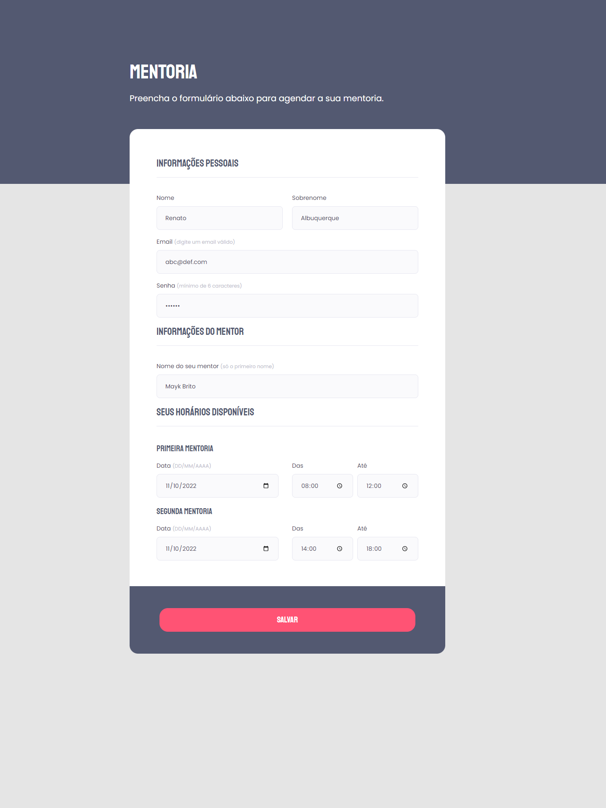

# Projeto 05 - Programa Explorer, Turma 06, Rocketseat

Projeto desenvolvido durante o Stage 03 do Programa Explorer, em Out/22.

Desafio 02 - Criando Formulários.

🔗 [Clique aqui para acessar](https://renato-albuquerque.github.io/projeto-05-explorer/)

## Tecnologias

- HTML
- CSS
- Git e Github

## Contato

🔗 [Linkedin](https://www.linkedin.com/in/renato-malbuquerque/)